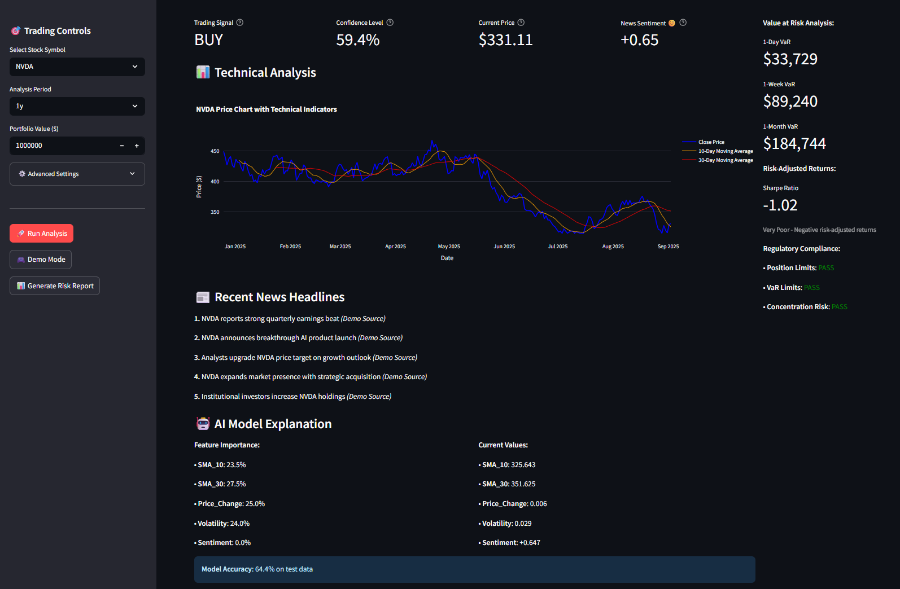
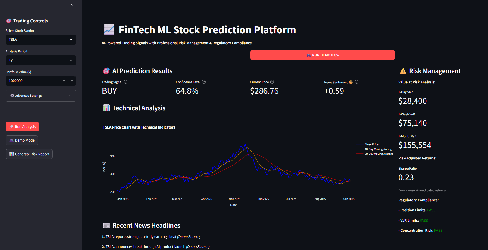

## 📈 FinTech ML Stock Prediction Platform

**AI-Powered Trading Signals with Professional Risk Management & Regulatory Compliance**

***

### 🚀 Project Overview

This repository contains a complete FinTech machine learning application for stock price signal generation, technical analysis, risk management, and regulatory compliance. The platform is designed to showcase modern data science and financial engineering skills using Python, Streamlit, and ML pipelines.

Key features:
- **Real-time trading signals** (BUY/SELL) based on engineered financial indicators and news sentiment.
- **Risk management dashboard** with Value at Risk (VaR), Sharpe ratio, and compliance status.
- **Interactive charts and news headlines** for transparency and explainability.
- **Easy-to-use, secure, and modular codebase** ready for further extension or deployment.

***

### 🛠️ Tech Stack

- **Python 3.9+**
- **Streamlit** — for interactive dashboards
- **scikit-learn** — for ML models (Random Forest ensemble)
- **pandas, numpy** — for data manipulation
- **plotly** — for interactive charts
- **python-dotenv** — for environment variable management
- **Other libraries** — yfinance, requests, etc.

***

### 🌐 APIs & Data Sources

- **Yahoo Finance**: Stock price data
- **NewsAPI**: Financial news headlines (requires API key)
- **Local Simulation**: Demo data available for safe demonstration

***

### ⚡ Features

- **AI predictions:** ML model trained on financial indicators and news sentiment
- **Model Explainability:** Feature importance and real-time values
- **Risk Management:** VaR, Sharpe Ratio, institutional limits
- **Regulatory Compliance:** Automated audit checks
- **Demo & Real Data Modes:** Fast demo with synthetic data, real analysis with API

***

### 🎬 Demo



***

### 🔒 API Key & Secrets Management

This project **does not store secrets in the repo**.

- **API keys are loaded from a local `.env` file** (NOT COMMITTED).
- See `.env.example` for the template.
- Never hardcode real credentials.

**How to use your API key securely:**

1. Copy `.env.example` to `.env`
2. Insert your NewsAPI key (or other secrets)
3. `.env` is in `.gitignore` so it won't be pushed to GitHub

***

### 🏁 Getting Started

#### Prerequisites

- Python 3.9+
- Pip

#### Installation

```bash
git clone https://github.com/yourusername/fintech-ml-stock-prediction.git
cd fintech-ml-stock-prediction

# Create and activate virtual environment (optional but recommended)
python -m venv venv
source venv/bin/activate      # On Mac/Linux
venv\\Scripts\\activate       # On Windows

# Install dependencies
pip install -r requirements.txt

# Create your .env file for NewsAPI key and configuration
cp .env.example .env
# Edit .env and set NEWS_API_KEY=your_actual_key
```

#### Running the Dashboard

```bash
streamlit run main.py
```

Then open [http://localhost:8501](http://localhost:8501)

***

### 💡 Usage

- Select stock symbol, time period, and portfolio value on the dashboard
- Click **Run Analysis** for live prediction (requires API key)
- Click **Demo Mode** for fast demo with synthetic data (no internet required)
- View trading signals, technical charts, risk metrics and compliance status
- Click **Generate Report** for a summary displayed in dashboard

***

### 🗃️ Repository Structure

```
fintech-ml-stock-prediction/
├── main.py                 # Streamlit dashboard app
├── data_manager.py         # Data collection and storage
├── ml_engine.py            # ML model pipeline
├── banking_layer.py        # Risk management & compliance logic
├── config.py               # Configuration (loads secrets from .env)
├── requirements.txt        # Dependencies
├── LICENSE                 # MIT License
├── test_system.py          # Testng purposes
└── README.md               # Project documentation
```

***

### 🤝 Contributing

Pull requests are welcome! Please open issues for bugs or suggestions.

1. Fork this repo
2. Create your feature branch (`git checkout -b feature/foo`)
3. Commit your changes (`git commit -am 'Add new feature'`)
4. Push to your branch (`git push origin feature/foo`)
5. Open a Pull Request

***

### 📝 License

This project is licensed under the MIT License.

***

### ✨ Acknowledgments

Inspired by finance open-source ML projects and best practices for secure development.

***

### 📣 Contact

For questions or collaborations, open an issue or connect via [GitHub](https://github.com/Aadityaamlan-Panda).

***

**Happy Trading & Learning!** 🚀


